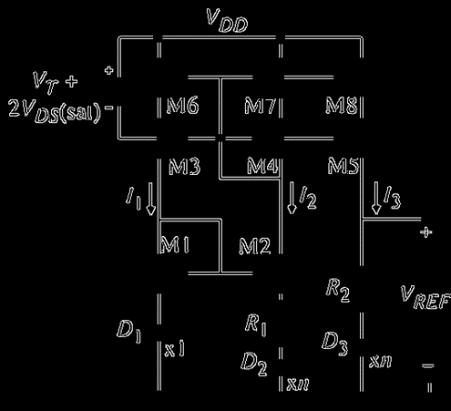

本项目为2024（第六届）集成电路 EDA 设计精英挑战赛的赛题十<针对模拟电路的电路图到网表自动生成>的实现源代码(最终并未提交参赛),同时也是2024年秋北京大学信息科学技术学院本科生课程<芯片设计自动化与智能优化>的课程项目.
# Requirements
```
python==3.12.1
matplotlib==3.9.2
numpy==1.26.4
opencv-python==4.10.0.84
pillow==10.4.0
ultralytics==8.3.49
```
其余版本兼容性未测试
# 使用说明 
在主目录执行
```
python analyze.py
```
即可输出生成的网表文件

## analyze.py
为最主要的功能实现程序。

### `task1`
`task1`函数实现的功能为对于 6th_integrated_circuit_eda_elite_challenge_question10_dataset/all_images 下的指定序号图片和对应标注数据的连线与网表分析。
参数 `datano` 为 all_images 下图片的序号

### `yolomodel_run`
`yolomodel_run`函数用以实现对于未标注的原始电路图图像进行标注并识别网表，将分析出的对应的网表字典输出到指定的generate_dir目录下
参数`model_dir`为使用的训练好的yolo model路径
`image_dir`为需要分析的图片集合所在文件夹
`run_dir`为弃用参数
`generate_dir`为生成的网表txt的存放路径

#### 电路功能 ckt_type 识别
囿于时间精力有限,没有进行具体实现,默认输出`DISO-Amplifier`

### `annotated_units`
`annotated_units` 类的功能是对图像及对应标注进行分析,传入参数`image`为图像,而`annotation_data`为对应的标注信息(格式参考6th_integrated_circuit_eda_elite_challenge_question10_dataset/all_images下的json标注信息).调用类函数`analyze`即可实现分析,分析结果位于self.unit_info中

#### 分析过程
初始化过程会主要对图像进行
1. 转换为灰度图
2. 高斯模糊[^1]

3. 边缘检测

4. 创造元件区域的掩膜

*上图为去除掩膜区域后的边缘图*
5. 查找轮廓

以便进一步分析

`get_contours`是进一步分析所调用的类函数,功能是实现查找所有有效的元件连线,并记录其连接的元件的连线端口信息[^连线端口与元件端口].
`if_search_iter`参数是为后续实现寻找最佳膨胀迭代数而预留的接口,目前并未完善.分析过程中需要先对去除元件区域查找出的边缘进行膨胀融合,使可能是同一根连线两侧的边缘都膨胀到一起,最终形成同一个轮廓.然而由于不同电路图的连线粗细并不一致,故需要控制合适的膨胀迭代数.


`get_all_unit_contour_connnections`是下一步分析所调用的类函数,功能是对于所有的元件识别出其元件端口所对应的连线端口[^连线端口与元件端口]及连线.
实现方法为对于每一种元件，设定一个固定方向的基准元件。对于具体元件，判断其相对于基准元件的方向，得到变换矩阵。每个基准元件的元件端口的相对位置提前标注好(`RELATIVE_PORT_DICT`)，通过变换矩阵变换，就能得知具体元件的元件端口的在图像中的理论相对位置。最后寻找最近的连线端口进行绑定.
其中相对方向的判定的实现途径是通过上下左右对称性和相对白色像素密度的对比,具体实现参考类函数`find_symmetry_and_density`.方法相对原始,有一定概率误判,有待改进.

`get_netlist`是分析连线关系后分析网表关系的类函数,功能是构建出符合赛题要求的网表.由于识别出的部分元件存在cross现象,即部分元件的两个端口代表的是连接到同一个网络(如两根连线交叉`cross-line-curved`);此外一些识别出的元件并不在比赛要求输出的元件类型中;还需要识别VDD,VSS网络.因此需要将各个连线分类,形成最终网表.其中使用了并查集方法.

### `UnionFind`
并查集实现,用于生成netlist

## dataset_convert.py
功能是将赛事方提供的数据集转化为yolo训练所需训练集格式,包括标注数据的转换/标注与图片文件的重新组织.注意图片仍需通过 pic_resize.py 进行进一步转换.

## pic_resize.py
功能是将训练图片重新放缩为统一尺寸,以及修改为jpg格式,以迎合yolo训练要求.

## read_annotations.py
作用是读取赛事方提供的数据集的标注数据,以图片形式展示,也可保存.`DATANO`为图片序号.
可用于手动矫正训练数据集错误.

## yolo11_train.py
作用是在yolo11预训练模型基础上训练电路元件识别模型
如果想重新训练 yolo11 模型，需要手动修改 datasets/eda/eda.yaml 中的 path 为当前的 datasets/eda 的绝对目录


## 如何评估输出网表精度
详见public目录下的README

# 实际预测效果
测试报告可见public/validation_report.md. 在40个样例中仅有一例完全正确,多数由于未知原因GED测试程序超时.

以下为两例识别效果图


# 存在的不足与改进空间
1. 连线识别仍然不够准确.可以考虑ocr删除文字干扰预处理,以及自适应的膨胀迭代数实现.此外,对于虚线电路连线的支持\对于干扰勾画线的排除有待挖掘.
2. 连线端口识别仍有瑕疵.目前的连线端口[^连线端口与元件端口]位置计算是对同一个连线与元件区域的交接区域求平均,然而在同一连线连接同个元件多个元件端口时会产生误差,影响后续元件端口到连线端口的绑定
3. 元件方向判断不够准确,可以考虑改进对称性算法\白色像素密度算法,或直接更换算法
4. yolo模型推理准确度可进一步提高.由于gpu资源和时间有限,此版本模型只训练了100个epoch.然而loss还有更多的收敛空间.以及原数据集存在部分错误标注可以修正.
5. 计算效率可进一步提高,通过改进算法\数据结构\内存管理
6. 电路功能预测有待实现

# 参考资料
https://docs.qq.com/doc/DY21FS2xkV3NqT2xR
https://github.com/CjLiu-NJU/6th_integrated_circuit_eda_elite_challenge_question10_dataset
https://docs.qq.com/doc/DR2pYcm91T0VBUXlY
https://docs.ultralytics.com/
https://eda.icisc.cn/download/toVideoDetail?id=ac13a48cb4254f6ebbb37af2ede176c7

[^1]:以下示例电路图来源于6th_integrated_circuit_eda_elite_challenge_question10_dataset/all_images下的38号电路图

[^连线端口与元件端口]:我们将从图片上连线与元件区域的相接关系找到的端口称为*连线端口*,而从元件本身类型出发而推断出应该有的端口称为*元件端口*